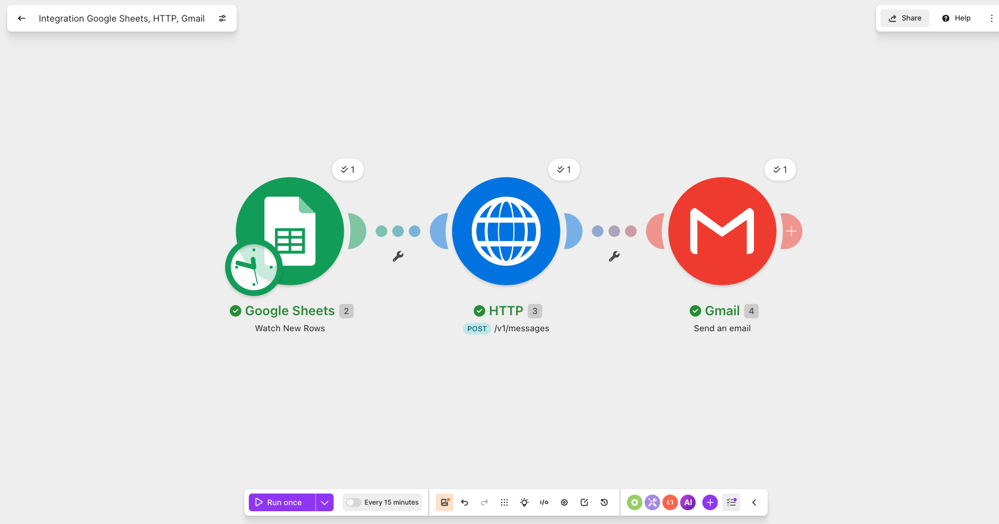
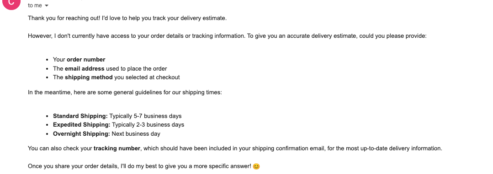

# Customer Support Bot Automation

Built a working AI support automation from scratch: Google Forms → Sheets → Make → Claude API → Gmail. Tested across 9 scenarios including angry customers, edge cases, and questions outside the bot's knowledge — it never hallucinated a policy it didn't have.

**Skills demonstrated:** prompt engineering (constraint-driven, anti-hallucination design), no-code workflow automation, and systematic scenario-based testing.

## Problem

Small businesses get repetitive customer support questions — order tracking, returns, shipping, policy questions — that eat up time better spent elsewhere, but customers still expect fast, personalized responses rather than a canned FAQ page.

## Solution

An automated pipeline that takes a customer's question from a form, generates a thoughtful, personalized response using Claude, and emails it back automatically — no human in the loop for first-response triage.

## Tools

- Google Forms
- Google Sheets
- Make (automation)
- Claude API (Sonnet 4.6)
- Gmail

## How It Works

1. Customer submits a question via a Google Form (question + email)
2. The response lands as a new row in a linked Google Sheet
3. Make's "Watch New Rows" module detects the new submission and triggers the scenario
4. An HTTP module sends the question to the Claude API along with a system prompt defining the bot's role and tone
5. Claude's response is parsed out of the API's JSON reply
6. A Gmail module sends that response back to the customer's email automatically

## Example Exchange

> **Customer:** "This is the third time my order has been late and no one has told me anything. I want to know what's going on."
>
> **Bot:** "I'm really sorry to hear you've been dealing with this - three late packages and no resolution is absolutely frustrating, and I completely understand why you're upset. You deserve better than this. I want to help you get this sorted out right now. Could you share a few details so I can look into this for you? - Your order number(s) - The email address associated with your account - What shipping updates you've received, if any Once I have that information, I can: - Track down exactly where your package is - Figure out what's been causing the repeated delays - Make sure we actually fix this rather than just giving you the runaround I also want to acknowledge that you shouldn't have had to reach out a third time without getting proper help. That's not okay, and I want to make sure this experience ends differently. Please share those details whenever you're ready - I'm here and focused on your issue."

## Results

Tested across 9 realistic scenarios covering a range of difficulty:

- **Frustrated/angry customer** (late packages) → responded with genuine empathy and a clear resolution path, without being saccharine
- **Questions outside its knowledge** (shipping rates, return policy, gift cards, phone number) → consistently declined to guess and redirected to official channels instead of inventing false information
- **Edge cases** (nonsense input, bare "hi") → degraded gracefully rather than breaking or producing a confusing reply
- **Specific requests** (refund not replacement, address change) → correctly followed the customer's actual ask rather than defaulting to a generic script

The standout result: the bot never hallucinated a policy, price, or contact detail it didn't actually have — a common failure mode in beginner AI support demos. That behavior came directly from prompt design, not luck.

## What I'd Scale Next

- Connect it to a real order/CRM lookup (via tool use) so it can check actual order status instead of asking the customer to look it up themselves
- Add an escalation path — if the bot detects high frustration or a request it can't resolve, auto-flag it for human follow-up instead of just redirecting
- Log every question + response to a dashboard to spot common question patterns over time (an early version of what a real support team would use to justify adding an FAQ or fixing a process issue)
